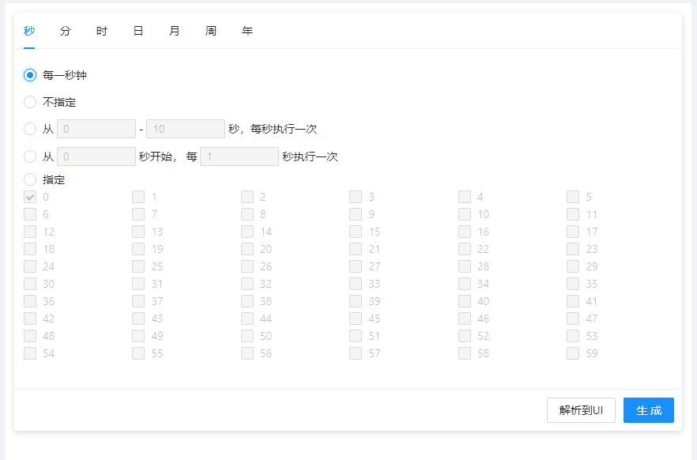
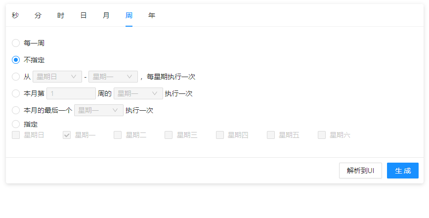

[](https://www.npmjs.com/package/qnn-react-cron)

> 使用中遇到问题欢迎提 issues

> 如果组件对你有帮助的话，请使用你那个发财的小手帮我点个星星吧！

<div align="center">
    <h1>QnnReactCron</h1>
    <div>基于React及Antd的cron时间表达式生成器</div>
    <br/>
    
    
</div>


### 声明

该组件改编自
<a href="https://github.com/zhengxiangqi/react-cron-antd">react-cron-antd</a>
<br />改编原因：作者长时间未更新组件 导致组件无法正常引用，除了修复了不能组件不能使用的问题外，<br />
在原基础增加：getCronFns、footer、国际化等功能使组件更加灵活强大，修改 value 值传入后或者更新后自动重新渲染

### 特性

-   🎉 全面支持 cron：秒、分、时、日、月、周、年
-   🎉 日及周条件互斥，自动改变响应值
-   🎉 支持反解析 cron 表达式到 UI
-   🎉 可结合此组件与 Antd 的下拉及输入组件封装成下拉输入框
-   🎉 国际化支持
-   🎉 TypeScript 支持


### 安装

    yarn add qnn-react-cron | npm i qnn-react-cron

### 预览地址

<a href="https://codesandbox.io/s/qnn-react-cron-fxvbp">codesandbox 点击直达</a>

### 使用

```jsx
import React from "react";
import Cron from "qnn-react-cron";

// 可使用 Cron.Provider 配置国际化语言
// 无需配置语言时，可不使用  Cron.Provider
// Cron.Provider 应该包裹于入口组件以实现全部路由下的组件内部语言都被自定义

export default ()=>{

    // language 为可选参数， 具体配置如下
    const language = {

        // 面板标题,
        // panel title,
        paneTitle:{
            second: "秒",
            minute: "分",
            hour: "时",
            day: "日",
            month: "月",
            week: "周",
            year: "年",
        },

        // assign  指定
        assign: "指定",
        // Don't assign  不指定
        donTAssign: "不指定",

        // Every minute ...   每一秒钟、每一分钟
        everyTime: {
            second: "每一秒钟",
            minute: "每一分钟",
            hour: "每一小时",
            day: "每一日",
            month: "每一月",
            week: "每一周",
            year: "每年",
        },

        // weel option  周选项
        week: {
            sun: "星期日",   
            mon: "星期一",
            tue: "星期二",
            wed: "星期三",
            thu: "星期四",
            fri: "星期五",
            sat: "星期六",
        },

        // from [a] to [b] [unit], executed once [unit]    a 到 b 每一个时间单位执行一次
        aTob: {
            second: (AInput, BInput) => (
                <span>
                    从{AInput}-{BInput}秒，每秒执行一次
                </span>
            ),
            minute: (AInput, BInput) => (
                <span>
                    从{AInput}-{BInput}分，每分钟执行一次
                </span>
            ),
            hour: (AInput, BInput) => (
                <span>
                    从{AInput}-{BInput}时，每小时执行一次
                </span>
            ),
            day: (AInput, BInput) => (
                <span>
                    从{AInput}-{BInput}日，每日执行一次
                </span>
            ),
            month: (AInput, BInput) => (
                <span>
                    从{AInput}-{BInput}月，每月执行一次
                </span>
            ),
            week: (AInput, BInput) => (
                <span>
                    从{AInput}-{BInput}，每星期执行一次
                </span>
            ),
            year: (AInput, BInput) => (
                <span>
                    从{AInput}-{BInput}年，每年执行一次
                </span>
            ),
        },

        // from [a] [unit] start, every [b] Execute once [unit]   从 a 开始, 每一个时间单位执行一次
        aStartTob: {
            second: (AInput, BInput) => (
                <span>
                    从{AInput}秒开始，每{BInput}秒执行一次
                </span>
            ),
            minute: (AInput, BInput) => (
                <span>
                    从{AInput}分开始，每{BInput}分执行一次
                </span>
            ),
            hour: (AInput, BInput) => (
                <span>
                    从{AInput}时开始，每{BInput}小时执行一次
                </span>
            ),
            day: (AInput, BInput) => (
                <span>
                    从{AInput}日开始，每{BInput}日执行一次
                </span>
            ),
            month: (AInput, BInput) => (
                <span>
                    从{AInput}月开始，每{BInput}月执行一次
                </span>
            ),

            // [n] in the NTH week of this month    本月第 n 周的 星期[n] 执行一次
            week: (AInput, BInput) => (
                <span>
                    本月第{AInput}周的{BInput}执行一次
                </span>
            ),

            // 本月的最后一个 星期[n] 执行一次
            week2: (AInput) => <span>月的最后一个{AInput}执行一次</span>,

            year: (AInput, BInput) => (
                <span>
                    从{AInput}年开始，每{BInput}年执行一次
                </span>
            ),
        }

    };

    return <Cron.Provider value={{
        // Minimum optional year    最小可选择的年份
        minYear:new Date().getFullYear(),
        // Maximum optional year   最大可选择的年份
		maxYear:new Date().getFullYear() + 60,
        // language   国际化语言配置
        language
    }}>
            <Cron
                value="* * * * * ? *"

                // 配置面板的隐藏, false 即隐藏
                // Configuration panel hiding
                panesShow={{
                    second: true,
                    minute:true,
                    hour: true,
                    day: true,
                    month:true,
                    week:true,
                    year:true,
                }}

                // 默认显示哪个面板, 默认为 second， 如果隐藏了 second 需要自行设置
                // The default is second. If second is hidden, you need to set it by yourself
                defaultTab={"second"}

                // 未自定义底部按钮时，用户点击确认按钮后的回调
                // The bottom button is not customized when the user clicks the confirm button after the callback
                onOk={(value) => {
                    console.log("cron:", value);
                }}

                // 相当于 ref
                // equivalent to ref
                getCronFns={(fns) => {
                    // 获取值方法
                    // fns.getValue: () => string

                    // 解析Cron表达式到UI 调用该方法才可以重新渲染 【一般不使用】(value值改变后组件会自动更新渲染)
                    // fns.onParse: () => Promise().then(()=>void).catch(()=>()=>void),
                    this.fns = fns;
                }}

                // 自定义底部按钮后需要自行调用方法来或者值
                // After customizing the bottom button, you need to call the method or value
                footer={
                    [
                        //默认值
                         <Button style={{ marginRight: 10 }} onClick={()=>this.fns.onParse}>
                            解析到UI
                         </Button>
                        <Button type="primary"  onClick={()=>console.log(this.fns.getValue)}>
                            生成
                        </Button>
                    ]
                }
            />
    </Cron.Provider>
}
```

### TypeScript 描述

    // CronProps 组件接受的 props
    // CronFns 实际上是组件的 ref
    import { CronProps, CronFns } form "qnn-react-cron"

    // ts 中引用的方式
    import * as QnnCron form "qnn-react-cron"

### TypeScript 项目中使用

##### 方式一

用 * as 引入，这种方式和在ts项目中使用react一样，可能还需要修改 tsconfig.json，自行百度即可。

    import * as QnnCron form "qnn-react-cron"

##### 方式二

在项目的 src 中新增一个 custom.d.ts 然后写入下面内容。 

    declare module "qnn-react-cron" {
        const content: any;
        export default content;
    }

然后在项目中直接引用
    
    import QnnCron form "qnn-react-cron"

    ...

### 为什么没有 antd 组件的样式？

    在 0.5.3 版本后，为了避免打包后的样式影响定制的样式，样式使用按需加载。不再打包进组件代码中。
    解决方式1：
    在 babel 配置中加入以下代码：

    plugins:[
        [
            "import",
            {
                libraryName: "antd",
                libraryDirectory: "es",
                style: "css",
            },
            "ant",
        ]
    ]


    解决方式2：
    或者直接在项目中引入 antd 样式，如下

    import "antd/dist/antd.min.css"

### 一些参考

1、[配合 antd Form 组件使用，打造一个可控的输入组件](https://github.com/wangzongming/qnn-react-cron/issues/21#issuecomment-1480692706)
 

### LICENSE

MIT
