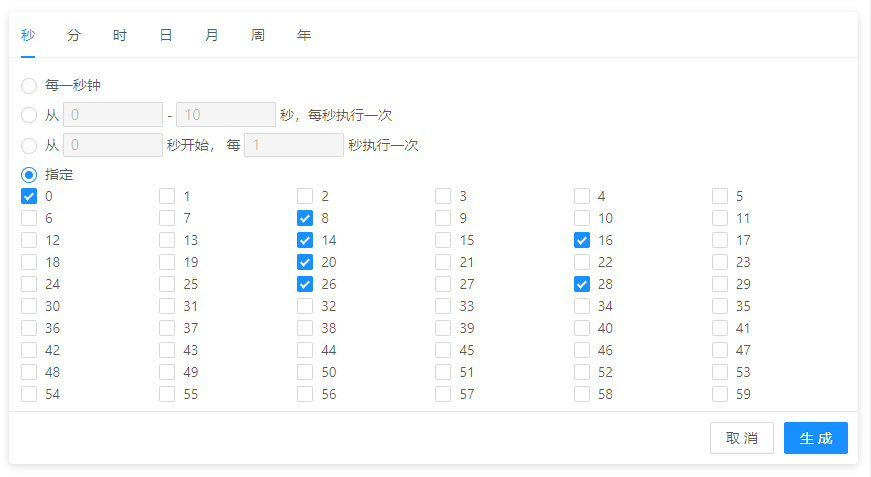

<div align="center">
    <h1>QnnReactCron</h1>
    <div>基于React及Antd的cron时间表达式生成器</div>
    <br/>
    
</div>

### 声明

该组件改编自
<a href="https://github.com/zhengxiangqi/react-cron-antd">react-cron-antd</a>
<br />改编原因：作者长时间未更新组件 导致组件无法正常引用，除了修复了不能组件不能使用的问题外，<br />
在原基础增加：getCronFns、footer属性使组件更加灵活，修改value值传入后或者更新后自动重新渲染

### 特性

-   🎉 全面支持 cron：秒、分、时、日、月、周、年
-   🎉 日及周条件互斥，自动改变响应值
-   🎉 支持反解析 cron 表达式到 UI
-   🎉 可结合此组件与 Antd 的下拉及输入组件封装成下拉输入框

### 安装

    yarn add qnn-react-cron | npm i qnn-react-cron

### 使用

```jsx
import React from "react";
import Cron from "qnn-react-cron";

export default ()=>{
    return <Cron
                value="* * * * * ? *"
                onOk={(value) => {
                    console.log("cron:", value);
                }}
                getCronFns={(fns) => {
                    // 获取值方法
                    // fns.getValue: () => string

                    // 解析Cron表达式到UI 调用该方法才可以重新渲染 【一般不使用】(value值改变后组件会自动更新渲染)
                    // fns.onParse: () => Promise().then(()=>void).catch(()=>()=>void),
                    this.fns = fns;
                }}
                footer={
                    [
                        //默认值
                         <Button style={{ marginRight: 10 }} onClick={()=>this.fns.onParse}>
                            解析到UI
                         </Button>
                        <Button type="primary"  onClick={()=>[onOk](this.fns.getValue)}>
                            生成
                        </Button>
                    ]
                }
            />
}
```

### 扩展

封装一个用于表单组件的 CronInput。
可参考  <a href="https://github.com/wangzongming/qnn-form/blob/master/src/components/inputs/Cron.js#L38">qnn-form组件中 cron 控件源码</a>

### LICENSE

MIT
